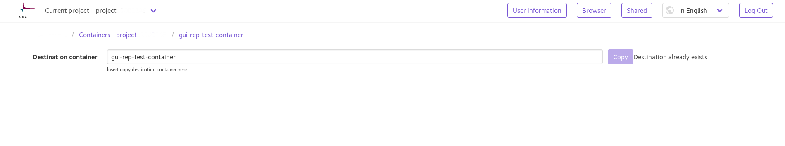

Upload runnner
==============
The UI provides an improved upload proxy / runner, that provides a possibility
for more complicated operations not normally present on the object storage Web
interface – these operations include e.g. uploading files into an object
storage container, and downloading a whole container with API call.

File Upload
-----------
Files can be uploaded to an automatically generated container by drag'n'drop
from the container listing page, or by using the upload button on top of the
table. There's no limit on how large the files uploaded can be, but browser
performance puts a practical limit somewhere in the neighborhood of 10GiB.

Uploading files to a specific container can be done by opening the container,
and uploading while the container is open. This can again be done either by
drag'n'drop or using the upload button.

.. hint:: If complete relative file paths or folder structure is to be
          preserved, the only option for uploading is drag'n'drop. Only
          files can be uploaded using the upload button

.. hint:: Chrome is recommended as the browser of choice when uploading large
          files, as the File API on Chrome is better implemented. Firefox tends
          to have issues on files >5GiB, especially with multiple files. Safari
          is not supported, but should work without problems – same issues
          present with Firefox apply.

.. hint:: Mobile devices are not supported for file uploads, but can work.
          This is, however, not guaranteed.

File Download
-------------
The upload runner is used to provide file downloads form shared containers in
a similar manner to the way the downloads work from containers owned by the
project that is currently active. To the user the download continues to be
a simple download link

Container Download
------------------
Full containers can be downloaded from the UI using the download button either
on the table row in the container listing, or a download button on the top of
the table when viewing an open container. Downloading whole containers works
the same in both owned and shared containers. The runner archives the
container while the download is taking place, in order to prevent additional
waiting for an archiving operation to finish. This has the added benefit of
not requiring any intermediary storage for the archiving operation on the
server side.

.. hint:: Due to the fact that the archive size can't be precisely calculated
          when archiving on the fly, the server is unable to provide a progress
          bar for a container download. A rough estimate can be generated by
          calculating the time value from the container size visible in the
          container listing using the available speed of the connection.

Copying a container
-------------------
Containers can be copied using the copy button, either on the row of the
container in the container listing view, or on top of the table when viewing
a specific container. The copy operation can only be performed to a fresh
container, to prevent accidental data loss in case of an incomplete copy
operation on an object. User can also copy a shared container to the
currently activated project.

.. hint:: The copy operation takes a long time, and is run in the background.
          The UI navigates back to the normal view after copying is initiated.
          Thus, the copy operation is eventually consistent.

.. hint:: The runner validates every copied object against the file checksum
          present in the object storage backend – thus, if the object is
          present in the newly created container, it's guaranteed to have been
          successfully copied over.

    Image of the container replication page when trying to copy over
    an existing container
