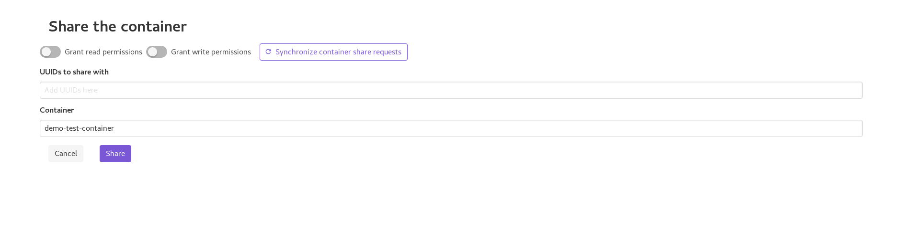
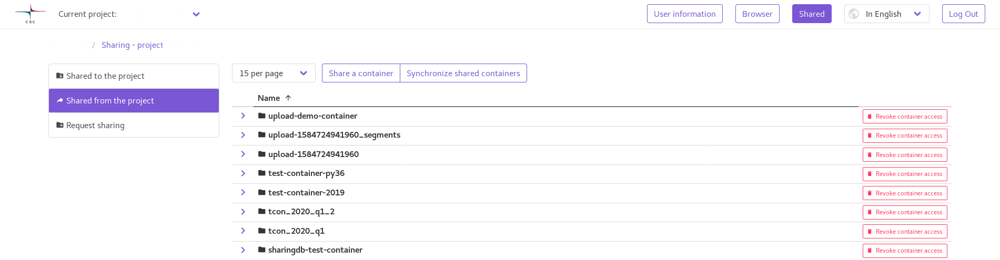
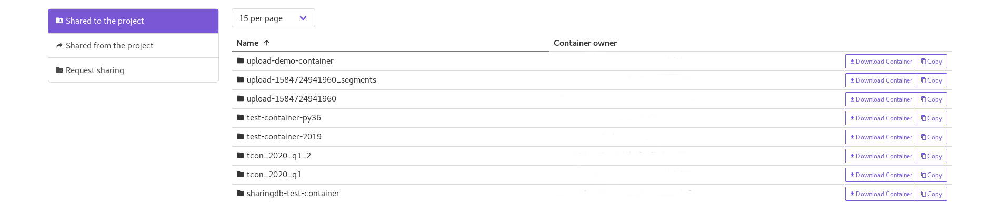

Sharing functionality
=====================
The UI provides a simple way of sharing containers between different projects,
provided you know the project that requests sharing. (If not, see the
documentation on sharing requests)

Sharing a container
-------------------
A container can be shared from the "share" button in the UI, on the row of the
container in the container listing. Clicking the button takes one to the
container sharing view, in which the user needs to specify the project/projects
the container is going to be shared to, and what rights to give. The view
also contains a button to synchronize any requests for accessing the container,
if any are present. In case the user doesn't want these requests fulfilled,
they can be removed from the tags that are inputted into the sharing view.

    Image of the container sharing view for an example container

Viewing containers shared from the project
------------------------------------------
Containers that have been shared from a particular project can be viewed by
navigating to the "Shared" page in the application navbar. From this view
the shared access can be revoked, a new share initiated, or existing access
synchronized to the sharing back-end, thus enabling it to be queried from
the back-end in the future.

    Image of the view listing containers shared from the project

Viewing containers shared to the project
----------------------------------------
Containers that are shared to a particular project can be viewed by navigating
to the "Shared" page in the application navbar. From this view the granted
access can be viewed, and any container can be opened just like when using
the normal container browsing view. All features available in the ordinary
container view work, such as downloading, uploading (if write access is
granted to the container) and copying the container.

    Image of the view listing containers shared to the project
